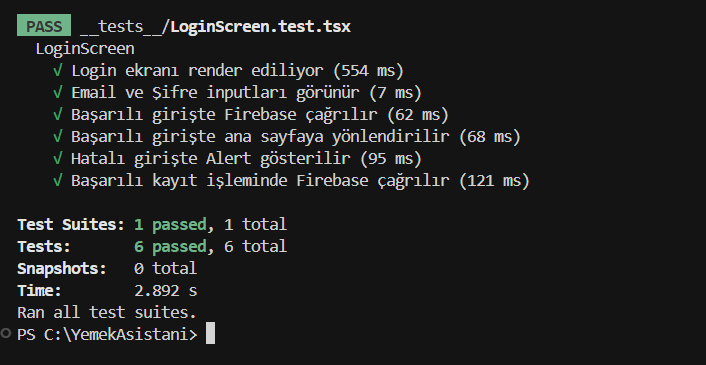

🍽️ Yemek Asistanım

Yemek Asistanım, kullanıcılara hızlı ve pratik yemek fikirleri sunan, tarif önerileri yapan ve yemek planlamayı kolaylaştırmayı amaçlayan bir mobil uygulamadır.
Proje; temiz kod prensipleri, modüler mimari ve kullanıcı dostu arayüz yaklaşımıyla geliştirilmiştir.

🚀 Özellikler

📱 React Native (Expo) ile mobil uygulama geliştirme

📍 Expo Router ile dosya tabanlı sayfa yönlendirme

🔐 Firebase Authentication & Firestore ile kullanıcı yönetimi

🧪 Jest + Testing Library ile UI birim testleri

📌 Email veya kullanıcı adı ile giriş yapılabilmesi

💡 Kayıt sırasında kullanıcı adı benzersizliği kontrolü

| Teknoloji | Kullanım Amacı |
|----------|----------------|
| React Native (Expo) | Mobil uygulama geliştirme |
| Expo Router | Sayfa yönlendirme ve navigation |
| Firebase Auth & Firestore | Kimlik doğrulama ve veri saklama |
| TypeScript | Tip güvenliği |
| Jest + @testing-library/react-native | UI birim testleri |

Login ve Kayıt (Register) ekranları

Kullanıcı bilgilerinin Firebase üzerinde saklanması

Expo Router ile ekranlar arası geçiş

Test altyapısı ile UI bileşenlerinin doğrulanması

Okunabilir, sürdürülebilir ve genişletilebilir kod yapısı

🧪 Testler

Bu projede gerçek kullanıcı senaryoları baz alınarak UI testleri yazılmıştır.

Test Edilen Senaryolar

✅ Login ekranının render edilmesi

✅ Email ve şifre inputlarının kontrolü

✅ Başarılı giriş senaryosu

✅ Hatalı giriş durumunda uyarı mesajı gösterilmesi

✅ Başarılı giriş sonrası yönlendirme

✅ Kayıt (register) işleminin test edilmesi

Test Yaklaşımı

Expo Router yönlendirme yapısı mock’lanmıştır

Firebase Authentication ve Firestore servisleri test ortamında izole edilmiştir

Jest ve Testing Library kullanılarak UI odaklı testler yazılmıştır

## Ekran Görüntüleri

Login Ekranı:  

 

 

